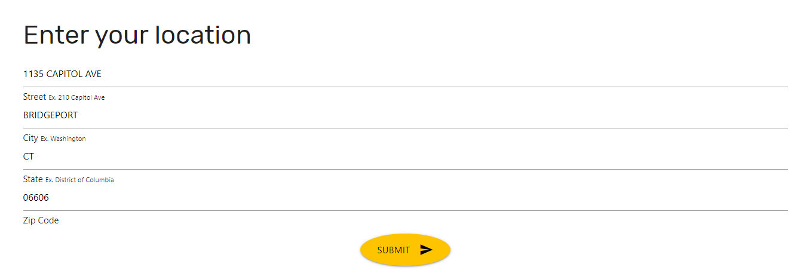
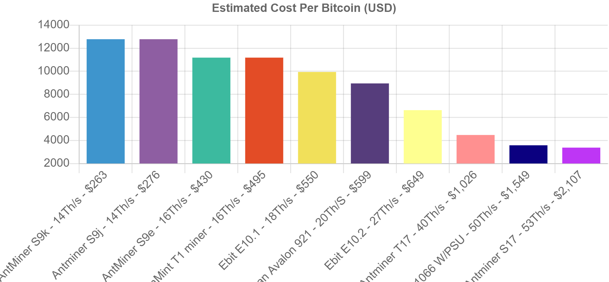

# Group-Project-1
*This program uses the cost of electricity in your region, along with the mining difficulty of the bitcoin network, to calculate an estimate of the electrical cost to mine 1 Bitcoin. The results are displayed amongst a selection of some of the top bitcoin miners on the market to see how each model stacks up. The calculations are calibrated to miners running on their normal power mode, not on their overclocked, or on power saving modes.

## Contributor(s)
  * This application was created by `Rafael Hermoso`, `Owais Master`, `Talib Shaikh` and  `Ivor Wallace`.
  
## Instructions
Bitcoin mining calculators today require extensive user input and supply little automation. Calculators today require the user to input data that can easily be pulled from API’s for increased accuracy

The application uses API data from the department of energy and pull the electrical rates of the users local utility company. With the electrical rate, the application can calculate the estimated cost to mine 1 bitcoin, given the present mining difficulty of the bitcoin network as defined by the blockchain API

The user find the best place to mine bitcoin down to the zip-code, compare mining hardware side by side, to see what the most cost-efficient option is for bitcoin mining, and track the mining difficulty in real time.

This application offers a mathematical equation to calculate costs given the appropriate variables, but the equation can be expanded. The chart displays one electric rate and multiple models of miners, however the long term goal is to gather more API data from other electric sources, like wind and solar power. 

### Technologies used:
  * JavaScript 
  * Materialize
  * Paralax
  * API
    * www.blockchain.com/api
    * www.yaddress.net/api
    * www.developer.nrel.gov/api